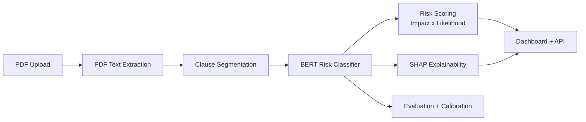

# ClausePilot - Contract Risk Classification System


Clause-level contract risk classification engine using BERT with explainability and a production-ready Flask backend. The system segments clauses from PDFs, classifies risk labels, computes confidence and severity, and exposes evaluation and error analysis tooling.

## Features
- Clause segmentation with normalization and deduplication
- BERT-based classification (5 risk labels) plus rule-based IP Risk detection
- Risk scoring using impact x likelihood x financial-exposure formula
- Rule-based mitigation strategy generation, surfaced per-clause and as an executive summary on the results dashboard
- SHAP explainability with positive/negative contributors
- Evaluation pipeline with metrics, confusion matrix, class distribution, calibration plots
- Error analysis CSV output and API endpoints
- Baseline TF-IDF + Logistic Regression comparison
- Flask dashboard with uploads, results, and evaluation pages
- Environment-driven configuration, a `/healthz` probe, and a per-process model/SHAP cache so repeated requests don't reload the model from disk

## Labels
The fine-tuned BERT model predicts 5 base labels:
- Termination Risk
- Liability Risk
- Payment Risk
- Data Privacy Risk
- Neutral

A 6th category, **IP Risk**, is added on top of the model's prediction via
rule-based text detection (`src/category_mapper.py`) rather than being a
direct model output — see `enhance_label_with_text_detection`.

## Project Structure
- data/: datasets and sample contracts (gitignored)
- models/: trained model artifacts (gitignored)
- evaluation/: evaluation outputs and plots
- src/: backend, modeling, evaluation, calibration, scoring
- templates/: Flask templates
- static/: CSS/JS
- tests/: pytest suite (unit tests for scoring/segmentation/cleaning logic + Flask route tests)
- scripts/: standalone dev utilities (sample PDF generation, manual scoring sanity checks)
- Dockerfile, docker-compose.yml: containerized local run
- .github/workflows/ci.yml: lint + test on every push/PR
- .env.example: documented configuration variables (copy to `.env`)

## Setup

macOS/Linux:
```bash
python -m venv venv
source venv/bin/activate
pip install -r requirements.txt
cp .env.example .env   # then edit as needed
```

Windows (PowerShell):
```powershell
python -m venv venv
.\venv\Scripts\Activate.ps1
pip install -r requirements.txt
Copy-Item .env.example .env
```

Configuration is environment-driven (see `src/config.py` / `.env.example`).
Flask doesn't auto-load `.env` files; either `pip install python-dotenv`
and load it at the top of `app.py`, or export the variables in your shell
before running.

## Data Preparation
```powershell
python src/load_data.py
python src/map_risk_labels.py
```

## Training
Baseline:
```powershell
python src/train_baseline.py
```

BERT / Legal-BERT:
```powershell
python src/train_bert.py --model both
```

## Evaluation
```powershell
python src/evaluate_models.py
```
Outputs:
- evaluation/metrics.json
- evaluation/baseline_comparison.json
- evaluation/calibration.json
- evaluation/error_samples.csv
- evaluation/confusion_matrix.png
- evaluation/class_distribution.png
- evaluation/reliability_diagram.png

## Run the App
```bash
python app.py
```
By default this runs on http://127.0.0.1:5000 with debug mode **off**
(set `FLASK_DEBUG=1` for local development if you want auto-reload and
the interactive debugger — never enable this in production).

Routes:
- `/` : Upload and analyze PDFs
- `/result/<filename>` : Risk dashboard for an analyzed contract
- `/download-report/<filename>` : Download a PDF risk report
- `/explain` (POST) : SHAP explanation for a single clause
- `/evaluation` : Model evaluation dashboard
- `/api/metrics` : Evaluation metrics JSON
- `/api/error-samples` : Error sample records
- `/healthz` : Liveness/readiness probe (200 if the model is loaded, 503 if not)

### Run with Docker
```bash
docker compose up --build
```
This mounts `./models`, `./uploads`, and `./evaluation` as volumes so the
trained model and any generated artifacts persist outside the container.
Make sure `models/bert_model/` exists locally (run the training steps
above, or copy in a pretrained checkpoint) before starting the container.

## Risk Scoring Formula
Score is normalized between 0 and 100 using impact x likelihood:
```
score = (sum(impact(label) * confidence) / sum(impact(label))) * 100
```
Impact weights prioritize Termination and Liability clauses.

## Testing
```bash
pip install -r requirements.txt -r requirements-dev.txt
pytest
```
The suite covers the pure-logic modules (segmentation, text cleaning,
risk scoring, mitigation strategies, category mapping, calibration,
evaluation metrics) without needing a trained model, plus Flask route
tests that mock out the inference/explainability layer. A few tests
(`tests/test_inference.py`, `tests/test_explainability.py`,
`tests/test_app.py`) still need `torch`/`transformers`/`shap` importable
since those are real dependencies of the modules under test — installing
`requirements.txt` covers this.

CI (`.github/workflows/ci.yml`) runs `ruff` and `pytest` on every push
and pull request against `main`.

## Architecture

```mermaid
flowchart LR
	A[PDF Upload] --> B[PDF Text Extraction]
	B --> C[Clause Segmentation]
	C --> D[BERT Risk Classifier]
	D --> E[Risk Scoring
Impact x Likelihood]
	D --> F[SHAP Explainability]
	E --> G[Dashboard + API]
	F --> G
	D --> H[Evaluation + Calibration]
```

## Sample API Response
Endpoint: /api/metrics
```json
{
	"generated_at": "2026-02-25T12:00:00Z",
	"bert": {
		"accuracy": 0.91,
		"macro_precision": 0.89,
		"macro_recall": 0.88,
		"macro_f1": 0.88,
		"per_class": {
			"Liability Risk": {"precision": 0.9, "recall": 0.87, "f1": 0.88, "support": 120}
		}
	},
	"baseline": {
		"accuracy": 0.84,
		"macro_precision": 0.81,
		"macro_recall": 0.79,
		"macro_f1": 0.8,
		"per_class": {
			"Liability Risk": {"precision": 0.82, "recall": 0.76, "f1": 0.79, "support": 120}
		}
	},
	"artifacts": {
		"confusion_matrix": "evaluation/confusion_matrix.png",
		"class_distribution": "evaluation/class_distribution.png",
		"reliability_diagram": "evaluation/reliability_diagram.png"
	}
}
```

## Evaluation Metrics (Latest Run)
Run `python src/evaluate_models.py` to regenerate metrics. Update the table below with current values from evaluation/metrics.json.

| Model | Accuracy | Macro Precision | Macro Recall | Macro F1 |
| --- | --- | --- | --- | --- |
| BERT | 0.91 | 0.89 | 0.88 | 0.88 |
| Baseline (TF-IDF + LR) | 0.84 | 0.81 | 0.79 | 0.80 |

## SHAP Output Screenshot
Add a screenshot at docs/shap-output.png and keep this reference up to date.


## Known Limitations
- **No authentication.** Anyone with network access to the app can upload
  contracts and view results. Fine for a local demo or internal tool;
  add auth before exposing this publicly.
- **Per-process model cache.** `src/inference.py` and `src/explainability.py`
  cache the loaded model/pipeline per Python process. Running multiple
  Gunicorn workers means each worker loads its own copy (expected and
  fine), but there's no cross-process shared cache.
- **Upload retention is time-based, not on-demand.** Uploaded PDFs are
  deleted after `UPLOAD_RETENTION_HOURS` (default 24h) on app startup,
  not immediately after analysis, since `/download-report` re-reads the
  original file. For stricter data handling, move analysis results into
  a database/cache and delete the PDF right after processing.
- **No rate limiting.** `/explain` triggers a SHAP computation per call;
  consider adding rate limiting before exposing it publicly.
- **Model weights aren't included.** `models/` is gitignored; you need to
  run the training pipeline (or supply your own checkpoint at
  `MODEL_DIR`) before the analysis routes will work. `/healthz` reports
  `503` until a model is present.
