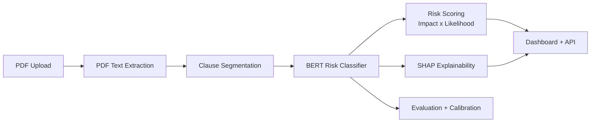

# ClausePilot - Contract Risk Classification System

Clause-level contract risk classification engine using BERT with explainability and a production-ready Flask backend. The system segments clauses from PDFs, classifies risk labels, computes confidence and severity, and exposes evaluation and error analysis tooling.

## Features
- Clause segmentation with normalization and deduplication
- BERT-based classification (5 risk labels)
- Risk scoring using impact x likelihood formula
- SHAP explainability with positive/negative contributors
- Evaluation pipeline with metrics, confusion matrix, class distribution, calibration plots
- Error analysis CSV output and API endpoints
- Baseline TF-IDF + Logistic Regression comparison
- Flask dashboard with uploads, results, and evaluation pages

## Labels
- Termination Risk
- Liability Risk
- Payment Risk
- Data Privacy Risk
- Neutral

## Project Structure
- data/: datasets and sample contracts
- models/: trained model artifacts
- evaluation/: evaluation outputs and plots
- src/: backend, modeling, evaluation, calibration, scoring
- templates/: Flask templates
- static/: CSS

## Setup
```powershell
python -m venv venv
\.\venv\Scripts\Activate.ps1
pip install -r requirements.txt
```

## Data Preparation
```powershell
python src/load_data.py
python src/map_risk_labels.py
```

## Training
Baseline:
```powershell
python src/train_baseline.py
```

BERT / Legal-BERT:
```powershell
python src/train_bert.py --model both
```

## Evaluation
```powershell
python src/evaluate_models.py
```
Outputs:
- evaluation/metrics.json
- evaluation/baseline_comparison.json
- evaluation/calibration.json
- evaluation/error_samples.csv
- evaluation/confusion_matrix.png
- evaluation/class_distribution.png
- evaluation/reliability_diagram.png

## Run the App
```powershell
python app.py
```
Routes:
- / : Upload and analyze PDFs
- /evaluation : Model evaluation dashboard
- /api/metrics : Evaluation metrics JSON
- /api/error-samples : Error sample records

## Risk Scoring Formula
Score is normalized between 0 and 100 using impact x likelihood:
```
score = (sum(impact(label) * confidence) / sum(impact(label))) * 100
```
Impact weights prioritize Termination and Liability clauses.

## Architecture


## Sample API Response
Endpoint: /api/metrics
```json
{
	"generated_at": "2026-02-25T12:00:00Z",
	"bert": {
		"accuracy": 0.91,
		"macro_precision": 0.89,
		"macro_recall": 0.88,
		"macro_f1": 0.88,
		"per_class": {
			"Liability Risk": {"precision": 0.9, "recall": 0.87, "f1": 0.88, "support": 120}
		}
	},
	"baseline": {
		"accuracy": 0.84,
		"macro_precision": 0.81,
		"macro_recall": 0.79,
		"macro_f1": 0.8,
		"per_class": {
			"Liability Risk": {"precision": 0.82, "recall": 0.76, "f1": 0.79, "support": 120}
		}
	},
	"artifacts": {
		"confusion_matrix": "evaluation/confusion_matrix.png",
		"class_distribution": "evaluation/class_distribution.png",
		"reliability_diagram": "evaluation/reliability_diagram.png"
	}
}
```

## Evaluation Metrics (Latest Run)
Run `python src/evaluate_models.py` to regenerate metrics. Update the table below with current values from evaluation/metrics.json.

| Model | Accuracy | Macro Precision | Macro Recall | Macro F1 |
| --- | --- | --- | --- | --- |
| BERT | 0.91 | 0.89 | 0.88 | 0.88 |
| Baseline (TF-IDF + LR) | 0.84 | 0.81 | 0.79 | 0.80 |

## SHAP Output Screenshot
Add a screenshot at docs/shap-output.png and keep this reference up to date.


